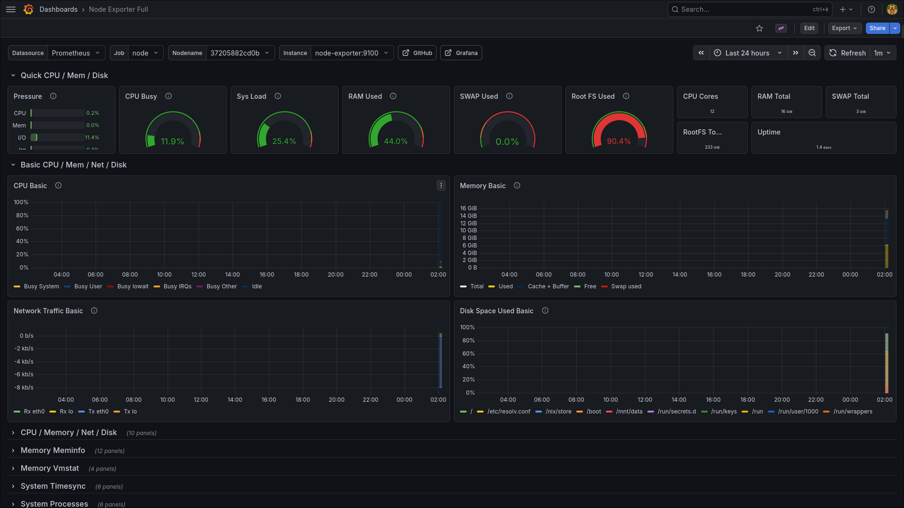

# StarterLab 🚀

StarterLab is a self-hosted development environment bootstrapper that provisions a full stack of services using Docker, with a single command.

### Homepage

### Grafana

### Vaultwarden

### Gitea

## Features
- Cross-distro (Ubuntu, Fedora, Arch, NixOS)

- CI-tested

- Container-aware

- Reproducible

## Quick Start
git clone https://github.com/karimKandil0/StarterLab.git

cd StarterLab

./scripts/setup.sh

./scripts/start.sh

## Non-interactive
./scripts/setup.sh --non-interactive

## Configuration (.env)
PORT=8080

HOME_HOST=home.localhost

VAULT_HOST=vault.localhost

GITEA_HOST=gitea.localhost

GRAFANA_HOST=grafana.localhost

ENABLE_VAULTWARDEN=Y

ENABLE_GITEA=Y

ENABLE_GRAFANA=Y

## Structure
compose/        → Docker stack
config/         → Service configs
data/           → Volumes
scripts/        → Installer
homepage/       → Dashboard
proxy/          → Reverse proxy
docs/           → Docs

## CI
Tested on Ubuntu, Fedora, Arch using GitHub Actions.

## Scripts
setup.sh

start.sh

stop.sh 

restart.sh

status.sh

## License
MIT
